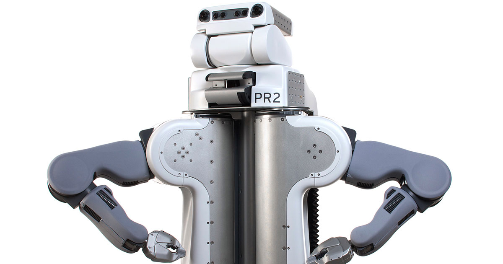
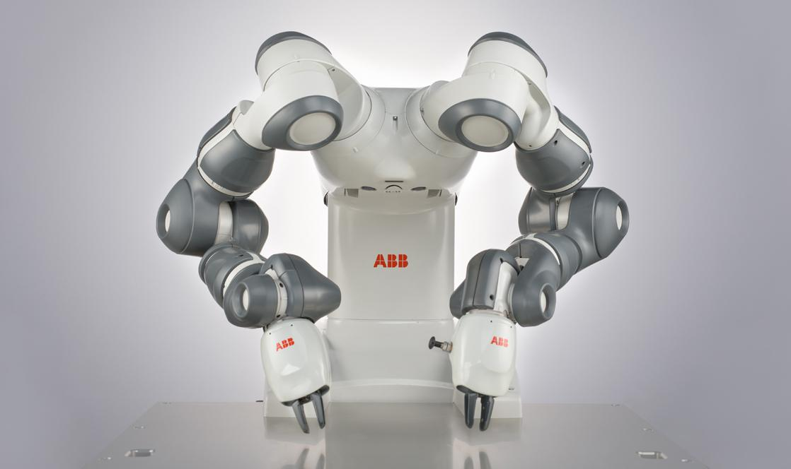
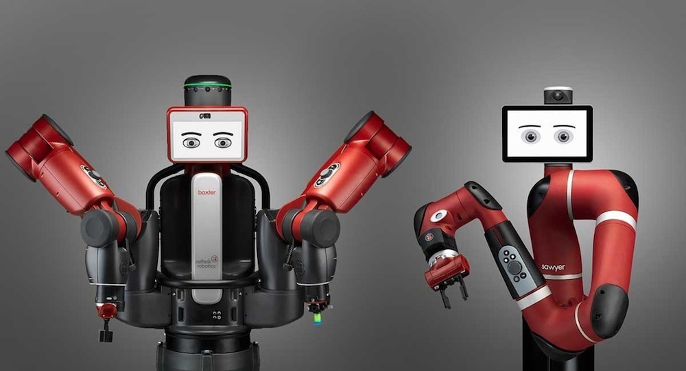
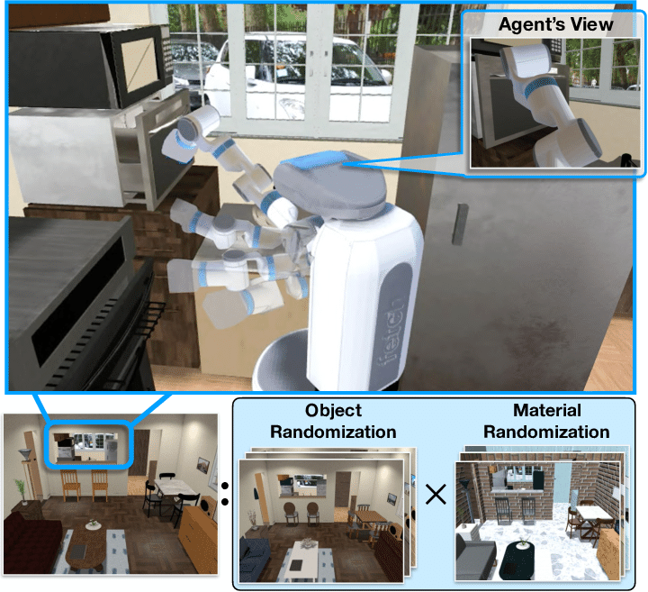

# awesome-bimanual-manipulation

This repository is mainly about robot bimanual manipulation / dual-arm manipulation. This is an ongoing project now, so keep an eye on it.

Related works are listed as follows:

## Survey

1. [Dual arm manipulation—A survey](https://www.sciencedirect.com/science/article/pii/S092188901200108X)  2012 | [Note](./Notes/Dual%20arm%20manipulation%20a%20survey.md)
2. [Two Arms are Better than One: A Behavior Based Control System for Assistive Bimanual Manipulation](http://citeseerx.ist.psu.edu/viewdoc/download?doi=10.1.1.94.3846&rep=rep1&type=pdf)  2007

## Talk

2021 ICRA Workshop on Bimanual Manipulation: Learning, Planning and Control

1. [Bimanual Manipulation -Complex, Human-like and Efficient Manipulation](https://www.youtube.com/watch?v=LSQZvQ3gppY)

## Methodology

### Learning 

1. [Efficient bimanual manipulation using learned task schemas](https://ieeexplore.ieee.org/abstract/document/9196958/?casa_token=4L7JbTtxEHIAAAAA:6YMmL2K8cUOA2t4L10DxCakin42t5Hlzn2HF6d8GBQ6Aff_S6vsB3qIrl6agNjKpIE7V5uL5)  ICRA 2020 | [video](https://www.youtube.com/watch?v=TBUEHk37a64)

2. [Fast Object Learning and Dual-arm Coordination for Cluttered Stowing, Picking, and Packing](https://arxiv.org/pdf/1810.02977.pdf)  ICRA 2018

**Imitation Learning**

1. [Imitation learning of dual-arm manipulation tasks in humanoid robots](http://citeseerx.ist.psu.edu/viewdoc/download?doi=10.1.1.1081.2813&rep=rep1&type=pdf)  IJHR 2008
2. [Deep Imitation Learning for Bimanual Robotic Manipulation](https://arxiv.org/pdf/2010.05134.pdf)  NeurIPS 2020
3. [Shared-Control-Based Bimanual Robot Manipulation](https://par.nsf.gov/servlets/purl/10104547)  Science Robotics 2019 | [video](https://www.youtube.com/watch?v=cGh0UncVxck)
4. [Learning bimanual end-effector poses from demonstrations using task-parameterized dynamical systems](https://ieeexplore.ieee.org/abstract/document/7353413/)  IROS 2015

**Reinforcement Learning**

1. [Exploiting symmetries in reinforcement learning of bimanual robotic tasks](https://ieeexplore.ieee.org/abstract/document/8637816/?casa_token=yrF2c8vpWJoAAAAA:SH4mkmqsfU0hmQHKP4wDimRkREx41QclGn-7GXWxZKWDB86MX9gFMcsQd1rbvGrJoz4jlXi1)  RA-L 2019
2. [Reinforcement Learning of Clothing Assistance with a Dual-arm Robot](https://www.academia.edu/download/50846824/Reinforcement_learning_of_clothing_assis20161212-12628-ndv3vy.pdf)  RAS 2011

### Planning

1. [Bimanual grasp planning](https://ieeexplore.ieee.org/abstract/document/6100824/?casa_token=RHzt69-uJoEAAAAA:MuRnwdE1DMQ_6ozhD_JamdWW1f0WuVoaDzsXUJUGXlHr7RfCNeFS8LkVIiDad6slq8BCjdve)  Humanoids 2011

### Control

1. [Adaptive Neural Control for Dual-Arm Coordination of Humanoid Robot With Unknown Nonlinearities in Output Mechanism](https://ieeexplore.ieee.org/stamp/stamp.jsp?arnumber=6842647&casa_token=sScRNG3DG6YAAAAA:FRwHH2fsyJUVVAQVAZ6_UWhSg3t5zBRHqVa0UOod3165hiUuCG-2Cq24eGRr8UVorvLnKIxo)  IEEE TRANSACTIONS ON CYBERNETICS 2015
2. [Neural control of bimanual robots with guaranteed global stability and motion precision](https://ieeexplore.ieee.org/abstract/document/7574390/?casa_token=kQPBQG-y030AAAAA:AGVG2eb3TTfc7KayGN5kCzY3Pgj-810xfqGj3wx-txH2F1n3dRbpB0oBu4wz3EwpwIuf0ZFH)   IEEE TRANSACTIONS ON INDUSTRIAL INFORMATICS 2016
3. [Learning and Composing Primitive Skills for Dual-arm Manipulation](https://arxiv.org/pdf/1905.10578.pdf)  2019
4. [Composite-Learning-Based Adaptive Neural Control for Dual-Arm Robots With Relative Motion](https://ieeexplore.ieee.org/abstract/document/9305975/)  Aerospace Science and Technology 2021
5. [Visual Servoing of Humanoid Dual-arm Robot with Neural Learning Enhanced Skill Transferring Control](https://researchportal.port.ac.uk/portal/files/7703646/Postprint.pdf)  IJHR 2018

## Application

### Fold clothes

1. [Bimanual robotic cloth manipulation for laundry folding](https://ieeexplore.ieee.org/abstract/document/6095109/?casa_token=DHO31F1XhDkAAAAA:l5cLtrNkd-HU2IkWRdeMTjMy8CSM4E39tAFsaouhBsBwjGElVScntKAHvcVoT8F4WKrFM3eu)   IROS 2011
2. [Benchmarking Bimanual Cloth Manipulation](https://ieeexplore.ieee.org/abstract/document/8957044/?casa_token=7YDA1inxidMAAAAA:ae_aURxVJK_kBxHpJ78zuAF2yHyGqwPbxnVngts0mTInFP9O5Q8ydwY6bgTdVzhOL7l5r2xy)   RA-L 2020
3. [Dimensionality reduction for dynamic movement primitives and application to bimanual manipulation of clothes](https://ieeexplore.ieee.org/abstract/document/8344486/?casa_token=ysIfcg43YogAAAAA:WNm35Yx_e0attVsn1FsZjn5LxpxJ4W5wcYazVqvXQmHgAOuqqWfKozURCso7NORArhyRXDnp)  T-RO 2018

### Assembly 

1. [A **survey** of **dual**-**arm** robotic issues on assembly tasks](https://link.springer.com/chapter/10.1007/978-3-319-78963-7_59)  Robot Design, Dynamics and Control, 2019
2. [Robotized assembly process using Dual arm robot](https://www.sciencedirect.com/science/article/pii/S2212827114011354)  2014
3. [Dual Arm Peg-in-Hole Assembly with a Programmed Compliant System](https://ieeexplore.ieee.org/abstract/document/7057477)  URAI 2014
4. [Intuitive dual arm robot programming for assembly operations](https://www.sciencedirect.com/science/article/pii/S0007850614000201)  2014
5. [Dual arm robot in cooperation with humans for flexible assembly](https://www.sciencedirect.com/science/article/pii/S0007850617300975)  2017

### Bin Packing

1. [A Framework for Robotic Bin Packing with a Dual-Arm Configuration](https://link.springer.com/chapter/10.1007/978-3-030-20131-9_277)   , Advances in Mechanism and Machine Science 2018

### Exoskeletons

1. [Asymmetric bimanual control of dual-arm exoskeletons for human-cooperative manipulations](https://ieeexplore.ieee.org/abstract/document/8103340/?casa_token=itLqk0n913gAAAAA:jNaUD79YaXBjW8Ztjd0JpvgT35tpdL-B_L8AHt7hBf_gMLSmb0U3nZbtN7JfmT0bPj9gMjOC)  T-RO 2018

### Knotting of Rope

1. [In-air Knotting of Rope using Dual-Arm Robot based on Deep Learning](https://arxiv.org/pdf/2103.09402.pdf)  2021

## Related platforms/simulators/labs

### Platforms

1. PR2

   

2. ABB YuMi

   

3. Rethink Baxter and Sawyer (Of course it's not dual-arm)

   

### Simulators

1. [iGibson](http://svl.stanford.edu/igibson/)  

   iGibson is a very realistic 3D home scene simulator, which consists of 15 fully interactive scenes and 500+ object models. **But it might not be fully suitable for the bimanual manipulation.**

   

### Scientists/Labs

1. [Sylvain Calinon](https://calinon.ch/#)  EPFL

   *human-centred robot learning, Learning from Demonstration, Imitation Learning*

2. [Sergey Levine](http://people.eecs.berkeley.edu/~svlevine/)  UC Berkeley | **[Robotic Artificial Intelligence and Learning Lab (RAIL)](http://rail.eecs.berkeley.edu/)**

   *Robot learning, DRL, DL*

3. [Chelsea Finn](https://ai.stanford.edu/~cbfinn/)  Stanford

   *DRL, offline RL, Meta-learning*

