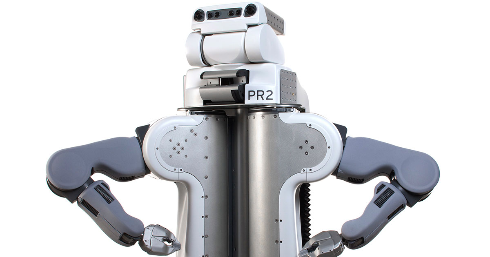
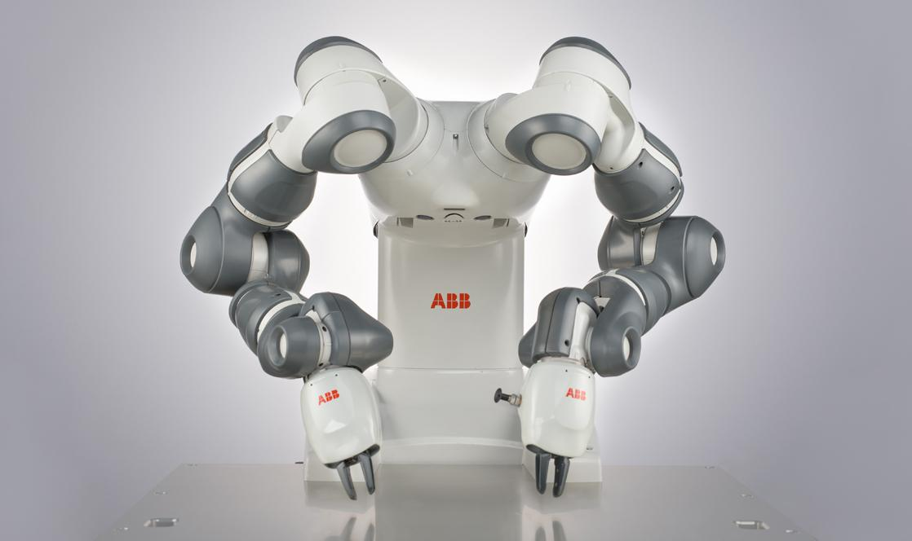
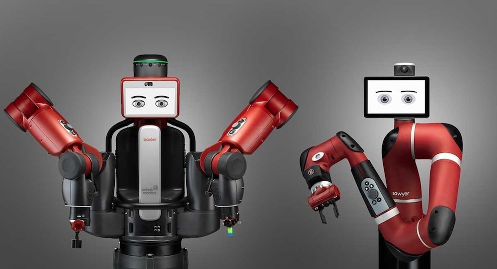
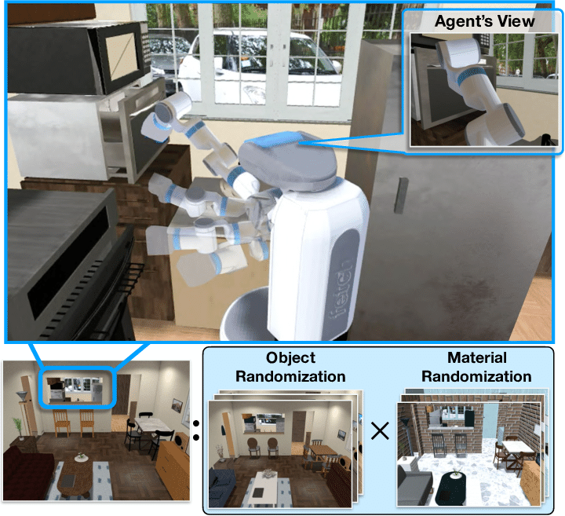

# awesome-bimanual-manipulation

This repository is mainly about robot bimanual manipulation / dual-arm manipulation. This is an ongoing project now, so keep an eye on it.

Related works are listed as follows:

> Note that some works are just pre-printed articles.

**[Comprehensive version README (with Authors & Figures)](./Comprehensive_readme.md)**

---

Content
- [awesome-bimanual-manipulation](#awesome-bimanual-manipulation)
  - [Survey](#survey)
  - [Workshop](#workshop)
  - [Benchmark](#benchmark)
  - [Methodology](#methodology)
    - [Learning](#learning)
    - [Planning and Control](#planning-and-control)
    - [Telemanipulation](#telemanipulation)
  - [Devices](#devices)
      - [End-effector](#end-effector)
  - [Application](#application)
    - [Fold clothes](#fold-clothes)
    - [Assembly](#assembly)
    - [Bin Packing](#bin-packing)
    - [Exoskeletons](#exoskeletons)
    - [Bio-medical](#bio-medical)
  - [Related platforms/simulators/labs](#related-platformssimulatorslabs)
    - [Platforms](#platforms)
    - [Simulators](#simulators)

## Survey

1. [Reinforcement Learning of Bimanual Robot Skills](https://link.springer.com/content/pdf/10.1007/978-3-030-26326-3.pdf)  Springer 2020
2. [Dual arm manipulation—A survey](https://www.sciencedirect.com/science/article/pii/S092188901200108X)  2012 | [Note](./Notes/Dual%20arm%20manipulation%20a%20survey.md)
3. [Two Arms are Better than One: A Behavior Based Control System for Assistive Bimanual Manipulation](http://citeseerx.ist.psu.edu/viewdoc/download?doi=10.1.1.94.3846&rep=rep1&type=pdf)  2007

## Workshop 

[2021 ICRA Workshop on Bimanual Manipulation: Learning, Planning and Control](https://sites.google.com/view/icra2021bi-mp/home)

1. [Bimanual Manipulation -Complex, Human-like and Efficient Manipulation](https://www.youtube.com/watch?v=LSQZvQ3gppY)

[2022 ICRA Workshop on Bi-manual Manipulation: Addressing Real-world Challenges](https://sites.google.com/view/bm4rw/home)

## Benchmark

1. [robosuite: A Modular Simulation Framework and Benchmark for Robot Learning](https://arxiv.org/pdf/2009.12293)  arxiv 2020
1. [The KIT Bimanual Manipulation Dataset](https://ieeexplore.ieee.org/stamp/stamp.jsp?tp=&arnumber=9555788) Humanoids 2020
1. [DQ robotics: A library for robot modeling and control](https://ieeexplore.ieee.org/abstract/document/9136790/) RA-M 2020
2. [Surreal: Open-source reinforcement learning framework and robot manipulation benchmark](http://proceedings.mlr.press/v87/fan18a.html) CoRL 2018

## Methodology

### Learning 

**Deep Learning**

1. [FabricFlowNet: Bimanual Cloth Manipulation with a Flow-based Policy](https://proceedings.mlr.press/v164/weng22a/weng22a.pdf) CoRL 2021 | [web](https://sites.google.com/view/fabricflownet)
2. [In-air Knotting of Rope using Dual-Arm Robot based on Deep Learning](https://arxiv.org/pdf/2103.09402.pdf)  iros 2021
2. [Fast Object Learning and Dual-arm Coordination for Cluttered Stowing, Picking, and Packing](https://arxiv.org/pdf/1810.02977.pdf)  ICRA 2018

**Imitation Learning / Learning from Demonstration (LfD)**

1. [Robot Cooking with Stir-fry: Bimanual Non-prehensile Manipulation of Semi-fluid Objects](https://arxiv.org/abs/2205.05960) RA-L 2022

2. [Passive Bimanual Skills Learning From Demonstration With Motion Graph Attention Networks](https://ieeexplore.ieee.org/stamp/stamp.jsp?arnumber=9720487) RA-L 2022

3. [Robot peels banana with goal-conditioned dual-action deep imitation learning](https://arxiv.org/pdf/2203.09749.pdf) arxiv 2022

4. [Transformer-based deep imitation learning for dual-arm robot manipulation](http://arxiv.org/abs/2108.00385)  IROS 2021

5. [Learning Object-Action Relations from Bimanual Human Demonstration Using Graph Networks](https://ieeexplore.ieee.org/stamp/stamp.jsp?tp=&arnumber=8880484) RA-L 2020

6. [Deep Imitation Learning for Bimanual Robotic Manipulation](https://arxiv.org/pdf/2010.05134.pdf)  NeurIPS 2020

7. [Guided Robot Skill Learning: A User-Study on Learning Probabilistic Movement Primitives with Non-Experts](https://ieeexplore.ieee.org/stamp/stamp.jsp?arnumber=9555785) Humanoids 2020  (Dual panda)

8. [Learning and Composing Primitive Skills for Dual-arm Manipulation](https://arxiv.org/pdf/1905.10578.pdf) arxiv 2019

9. [Learning Task Priorities From Demonstrations](https://ieeexplore.ieee.org/stamp/stamp.jsp?tp=&arnumber=8534450) T-RO 2019

10. [Dimensionality reduction for dynamic movement primitives and application to bimanual manipulation of clothes](https://ieeexplore.ieee.org/abstract/document/8344486/)  T-RO 2018

11. [Bimanual Skill Learning with Pose and Joint Space Constraints](https://ieeexplore.ieee.org/stamp/stamp.jsp?tp=&arnumber=8624993) Humanoids 2018

12. [Projected Force-Admittance Control for Compliant Bimanual Tasks](https://ieeexplore.ieee.org/stamp/stamp.jsp?tp=&arnumber=8624916) Humanoids 2018

13. [Constraints extraction from asymmetrical bimanual tasks and their use in coordinated behavior](https://www.sciencedirect.com/science/article/pii/S0921889017300465) RAS 2018

14. [Generalization of Task Model using Compliant Movement Primitives in a Bimanual Setting](https://ieeexplore.ieee.org/stamp/stamp.jsp?tp=&arnumber=8324707) ROBIO 2017

15. [Compliant Movement Primitives in a Bimanual Setting](https://ieeexplore.ieee.org/stamp/stamp.jsp?tp=&arnumber=8246899) Humanoids 2017

16. [Learning bimanual end-effector poses from demonstrations using task-parameterized dynamical systems](https://ieeexplore.ieee.org/abstract/document/7353413/)  IROS 2015

    

**Reinforcement Learning**

1. [Bi-Manual Manipulation and Attachment via Sim-to-Real Reinforcement Learning](https://arxiv.org/pdf/2203.08277.pdf) arxiv 2022
2. [DAIR: Disentangled Attention Intrinsic Regularization for Safe and Efficient Bimanual Manipulation](https://arxiv.org/pdf/2106.05907.pdf)  arxiv 2021
3. [Reinforcement Learning of Bimanual Robot Skills](https://link.springer.com/content/pdf/10.1007/978-3-030-26326-3.pdf)  Springer 2020
4. [Bimanual Regrasping for Suture Needles using Reinforcement Learning for Rapid Motion Planning](https://arxiv.org/pdf/2011.04813)  arxiv 2020
5. [Exploiting symmetries in reinforcement learning of bimanual robotic tasks](https://ieeexplore.ieee.org/abstract/document/8637816/?casa_token=yrF2c8vpWJoAAAAA:SH4mkmqsfU0hmQHKP4wDimRkREx41QclGn-7GXWxZKWDB86MX9gFMcsQd1rbvGrJoz4jlXi1)  RA-L 2019
6. [Door Opening by joining Reinforcement Learning and Intelligent Control](https://ieeexplore.ieee.org/abstract/document/8023522/)  ICRA 2017
7. [Extracting bimanual synergies with reinforcement learning](https://ieeexplore.ieee.org/iel7/8119304/8202121/08206356.pdf)  IROS 2017
8. [Trajectory-model-based reinforcement learning: Application to bimanual humanoid motor learning with a closed-chain constraint](https://ieeexplore.ieee.org/abstract/document/7030010/)  Humanoids 2013
9. [Efficient bimanual manipulation using learned task schemas](https://ieeexplore.ieee.org/abstract/document/9196958/?casa_token=4L7JbTtxEHIAAAAA:6YMmL2K8cUOA2t4L10DxCakin42t5Hlzn2HF6d8GBQ6Aff_S6vsB3qIrl6agNjKpIE7V5uL5)  ICRA 2020 | [video](https://www.youtube.com/watch?v=TBUEHk37a64)
10. [Reinforcement Learning of Clothing Assistance with a Dual-arm Robot](https://ieeexplore.ieee.org/stamp/stamp.jsp?tp=&arnumber=6100915)  RAS 2011
11. [Using dimensionality reduction to exploit constraints in reinforcement learning](https://ieeexplore.ieee.org/iel5/5639431/5648787/05650243.pdf)  IROS 2010

### Modelling 

1. [Redundancy Resolution for Dual-Arm Robots Inspired by Human Asymmetric Bimanual Action: Formulation and Experiments](https://ieeexplore.ieee.org/stamp/stamp.jsp?tp=&arnumber=7140049) ICRA 2015

### Planning and Control 

1. [Keypoint-Based Planar Bimanual Shaping of Deformable Linear Objects Under Environmental Constraints With Hierarchical Action Framework](https://ieeexplore.ieee.org/stamp/stamp.jsp?arnumber=9730102) RA-L 2022
2. [Coupled Multiple Dynamic Movement Primitives Generalization for Deformable Object Manipulation](https://ieeexplore.ieee.org/stamp/stamp.jsp?arnumber=9729408) RA-L 2022
3. [Mixtures of Gaussian Processes for Robot Motion Planning Using Stochastic Trajectory Optimization](https://ieeexplore.ieee.org/stamp/stamp.jsp?arnumber=9733096) T-SMC 2022
4. [Composite-Learning-Based Adaptive Neural Control for Dual-Arm Robots With Relative Motion](https://ieeexplore.ieee.org/stamp/stamp.jsp?arnumber=9305975)  TNNLS 2022
5. [Four-Arm Collaboration: Two Dual-Arm Robots Work Together to Manipulate Tethered Tools](https://ieeexplore.ieee.org/stamp/stamp.jsp?arnumber=9534689) T-Mech 2021
6. [Bidirectional Human–Robot Bimanual Handover of Big Planar Object With Vertical Posture](https://ieeexplore.ieee.org/stamp/stamp.jsp?arnumber=9319192) T-ASE 2021
7. [Initial Results on Grasping and Lifting Physical Deformable Bags with a Bimanual Robot](https://www.cs.cmu.edu/~dseita/data/Daniel_Seita_Physical_Bags_IROS_WS_2021.pdf) IROS 2021
8. [Action Planning for Packing Long Linear Elastic Objects into Compact Boxes with Bimanual Robotic Manipulation](https://arxiv.org/pdf/2110.11652.pdf) arxiv 2021
9. [Wrapp-up: A dual-arm robot for intralogistics](https://ieeexplore.ieee.org/abstract/document/9212558/) RA-M 2020
10. [Pick-and-place in dynamic environments with a mobile dual-arm robot equipped with distributed distance sensors](https://ieeexplore.ieee.org/stamp/stamp.jsp?arnumber=9555672) Humanoids 2020
11. [Discrete Bimanual Manipulation for Wrench Balancing](https://ieeexplore.ieee.org/stamp/stamp.jsp?tp=&arnumber=9196527) ICRA 2020
12. [Dual-arm robotic needle insertion with active tissue deformation for autonomous suturing](https://ieeexplore.ieee.org/abstract/document/8698220/) RA-L 2019
13. [Admittance control for collaborative dual-arm manipulation](https://ieeexplore.ieee.org/stamp/stamp.jsp?arnumber=8981624) ICAR 2019
14. [Finite-Time Convergence Adaptive Fuzzy Control for Dual-Arm Robot With Unknown Kinematics and Dynamics](https://ieeexplore.ieee.org/stamp/stamp.jsp?arnumber=8432051) TFS 2019
15. [Autonomous Dual-Arm Manipulation of Familiar Objects](https://ieeexplore.ieee.org/stamp/stamp.jsp?arnumber=8624922) Humanoids 2018
16. [A Certified-Complete Bimanual Manipulation Planner](https://ieeexplore.ieee.org/stamp/stamp.jsp?arnumber=8283571) T-ASE 2018
17. [Anthropomorphic, Compliant and Lightweight Dual Arm System for Aerial Manipulation](https://ieeexplore.ieee.org/stamp/stamp.jsp?arnumber=8202266) IROS 2017
18. [Neural control of bimanual robots with guaranteed global stability and motion precision](https://ieeexplore.ieee.org/abstract/document/7574390/?casa_token=kQPBQG-y030AAAAA:AGVG2eb3TTfc7KayGN5kCzY3Pgj-810xfqGj3wx-txH2F1n3dRbpB0oBu4wz3EwpwIuf0ZFH)   IEEE TRANSACTIONS ON INDUSTRIAL INFORMATICS 2016
19. [Adaptive Neural Control for Dual-Arm Coordination of Humanoid Robot With Unknown Nonlinearities in Output Mechanism](https://ieeexplore.ieee.org/stamp/stamp.jsp?arnumber=6842647&casa_token=sScRNG3DG6YAAAAA:FRwHH2fsyJUVVAQVAZ6_UWhSg3t5zBRHqVa0UOod3165hiUuCG-2Cq24eGRr8UVorvLnKIxo)  IEEE TRANSACTIONS ON CYBERNETICS 2015
9. [Bimanual grasp planning](https://ieeexplore.ieee.org/abstract/document/6100824/?casa_token=RHzt69-uJoEAAAAA:MuRnwdE1DMQ_6ozhD_JamdWW1f0WuVoaDzsXUJUGXlHr7RfCNeFS8LkVIiDad6slq8BCjdve)  Humanoids 2011

### Telemanipulation

1. [Cooperative Manipulation of Deformable Objects by Single-Leader-Dual-Follower Teleoperation](https://ieeexplore.ieee.org/stamp/stamp.jsp?arnumber=9673113) T-IE 2022
1. [Bimanual Telemanipulation with Force and Haptic Feedback and Predictive Limit Avoidance](https://ieeexplore.ieee.org/stamp/stamp.jsp?arnumber=9568842) ECMR 2021
2. [Online Recognition of Bimanual Coordination Provides Important Context for Movement Data in Bimanual Teleoperated Robots](https://ieeexplore.ieee.org/stamp/stamp.jsp?arnumber=9636272) IROS 2021
2. [Single Master Bimanual Teleoperation System With Efficient Regulation](https://ieeexplore.ieee.org/stamp/stamp.jsp?tp=&arnumber=9011601) T-RO 2020
2. [Relative Impedance-Based Internal Force Control for Bimanual Robot Teleoperation With Varying Time Delay](https://ieeexplore.ieee.org/stamp/stamp.jsp?arnumber=8678711)  T-IE 2020
2. [Shared Autonomous Interface for Reducing Physical Effort in Robot Teleoperation via Human Motion Mapping](https://ieeexplore.ieee.org/stamp/stamp.jsp?arnumber=9197220) ICRA 2020
2. [Shared-Control-Based Bimanual Robot Manipulation](https://par.nsf.gov/servlets/purl/10104547)  Science Robotics 2019 | [video](https://www.youtube.com/watch?v=cGh0UncVxck)
2. [An Intuitive, Affordances Oriented Telemanipulation Framework for a Dual Robot Arm Hand System: On the Execution of Bimanual Tasks](https://ieeexplore.ieee.org/stamp/stamp.jsp?arnumber=8967782) IROS 2019
2. [A wearable, ultralight interface for bimanual teleoperation of a compliant, whole-body-controlled humanoid robot](https://elib.dlr.de/128718/1/inProc.2019.Porges.TORO%20teleop.ICRA.pdf) ICRA 2019
2. [Adaptive Robust Control for Bimanual Cooperative Contact Teleoperation with Relative Jacobian Matrix](https://link.springer.com/content/pdf/10.1007/s10846-018-0863-z.pdf) Journal of Intelligent & Robotic Systems 2019
2. [Human-Robot Interaction Through Fingertip Haptic Devices for Cooperative Manipulation Tasks](https://ieeexplore.ieee.org/stamp/stamp.jsp?arnumber=8956350) RO-MAN 2019
2. [Physical Fatigue Analysis of Assistive Robot Teleoperation via Whole-body Motion Mapping](https://ieeexplore.ieee.org/stamp/stamp.jsp?arnumber=8968544) IROS 2019
2. [Shared-Autonomy Control for Intuitive Bimanual Tele-manipulation](https://ieeexplore.ieee.org/stamp/stamp.jsp?arnumber=8625047) Humanoids 2018 (Dual panda)

## Devices

#### End-effector

1. [Bimanual Handling of Deformable Objects With Hybrid Adhesion](https://ieeexplore.ieee.org/stamp/stamp.jsp?arnumber=9732638) RA-L 2022

## Application

> TODO: Reclassification

### Fold clothes

1. [Benchmarking Bimanual Cloth Manipulation](https://ieeexplore.ieee.org/abstract/document/8957044/?casa_token=7YDA1inxidMAAAAA:ae_aURxVJK_kBxHpJ78zuAF2yHyGqwPbxnVngts0mTInFP9O5Q8ydwY6bgTdVzhOL7l5r2xy)   RA-L 2020

2. [Dynamic cloth manipulation with deep reinforcement learning](https://ieeexplore.ieee.org/abstract/document/9196659/)  ICRA 2020

3. [Dimensionality reduction for dynamic movement primitives and application to bimanual manipulation of clothes](https://ieeexplore.ieee.org/abstract/document/8344486/?casa_token=ysIfcg43YogAAAAA:WNm35Yx_e0attVsn1FsZjn5LxpxJ4W5wcYazVqvXQmHgAOuqqWfKozURCso7NORArhyRXDnp)  T-RO 2018

4. [Bimanual robotic cloth manipulation for laundry folding](https://ieeexplore.ieee.org/abstract/document/6095109/?casa_token=DHO31F1XhDkAAAAA:l5cLtrNkd-HU2IkWRdeMTjMy8CSM4E39tAFsaouhBsBwjGElVScntKAHvcVoT8F4WKrFM3eu)   IROS 2011

   

### Assembly 

1. [A survey of dual-arm robotic issues on assembly tasks](https://link.springer.com/chapter/10.1007/978-3-319-78963-7_59)  Robot Design, Dynamics and Control, 2019

2. [Dual arm robot in cooperation with humans for flexible assembly](https://www.sciencedirect.com/science/article/pii/S0007850617300975)  2017

2. [Bimanual Folding Assembly: Switched Control and Contact Point Estimation](https://ieeexplore.ieee.org/stamp/stamp.jsp?tp=&arnumber=7803279) Humanoids 2016

3. [Robotized assembly process using Dual arm robot](https://www.sciencedirect.com/science/article/pii/S2212827114011354)  2014

4. [Dual Arm Peg-in-Hole Assembly with a Programmed Compliant System](https://ieeexplore.ieee.org/abstract/document/7057477)  URAI 2014

5. [Intuitive dual arm robot programming for assembly operations](https://www.sciencedirect.com/science/article/pii/S0007850614000201)  2014

   

### Bin Packing

1. [A Framework for Robotic Bin Packing with a Dual-Arm Configuration](https://link.springer.com/chapter/10.1007/978-3-030-20131-9_277)  Advances in Mechanism and Machine Science 2018

### Exoskeletons

1. [A Dual Arm Haptic Exoskeleton for Dynamical Coupled Manipulation](https://ieeexplore.ieee.org/stamp/stamp.jsp?arnumber=9517707) AIM 2021
1. [Human-inspired control of dual-arm exoskeleton robots with force and impedance adaptation](https://ieeexplore.ieee.org/abstract/document/8497078/) T-SMC 2020
1. [Coordination Control of a Dual-Arm Exoskeleton Robot Using Human Impedance Transfer Skills](https://ieeexplore.ieee.org/stamp/stamp.jsp?arnumber=7944582) T-SMC 2019
1. [Asymmetric bimanual control of dual-arm exoskeletons for human-cooperative manipulations](https://ieeexplore.ieee.org/abstract/document/8103340/?casa_token=itLqk0n913gAAAAA:jNaUD79YaXBjW8Ztjd0JpvgT35tpdL-B_L8AHt7hBf_gMLSmb0U3nZbtN7JfmT0bPj9gMjOC)  T-RO 2018

### Bio-medical

1. [Anthropomorphic Dual-Arm Coordinated Control for a Single-Port Surgical Robot Based on Dual-Step Optimization](https://ieeexplore.ieee.org/stamp/stamp.jsp?arnumber=9720487) T-MRB 2022

## Related platforms/simulators/labs

### Platforms

1. PR2

   

2. ABB YuMi

   

3. Rethink Baxter and Sawyer (Of course it's not dual-arm)

   

### Simulators

1. [iGibson](http://svl.stanford.edu/igibson/)  

   iGibson is a very realistic 3D home scene simulator, which consists of 15 fully interactive scenes and 500+ object models. **But it might not be fully suitable for the bimanual manipulation.**

   
